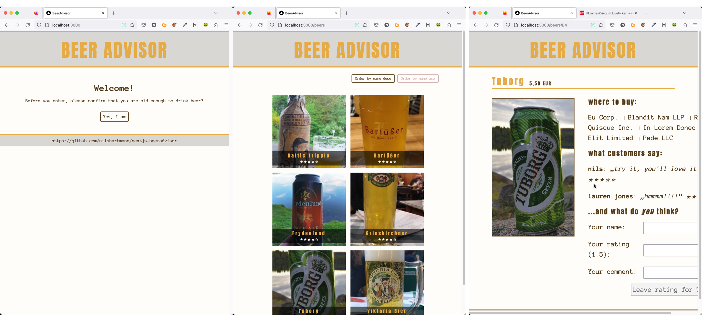

# "BeerAdvisor" Next.js Sample application

This repository contains an example fullstack React application with Next.js 13.4 App Router. It uses React Server components and both a database and an external REST service as datasources.



# Start:

Run the following commands from the root directory:

### 1. Start the database
* use docker-compose to start the database. (Note that port `1360` must be available)
```bash
docker-compose up -d
```
  * if you want to connect to the running database either use docker or connect with your fav db tool
    (for connection data see docker-compose file here)
### 2. Populate the database

* on first run only: setup the database content
```bash
pnpm db:reset
```

### 3. Shop API
* Start "Shop API" service by running `pnpm shop-backend`

### 3. Start Next.js application

* Install dependencies:
```bash 
pnpm install
```

* Start the application in dev mode:

```bash 
pnpm dev
```

### Feedback

If you have questions, comments or other feedback, feel free to raise an issue in this repository. You can also contact me on [Twitter](twitter.com/nilshartmann), [Mastodon](https://norden.social/@nilshartmann) or [my homepage](https://nilshartmann.net).